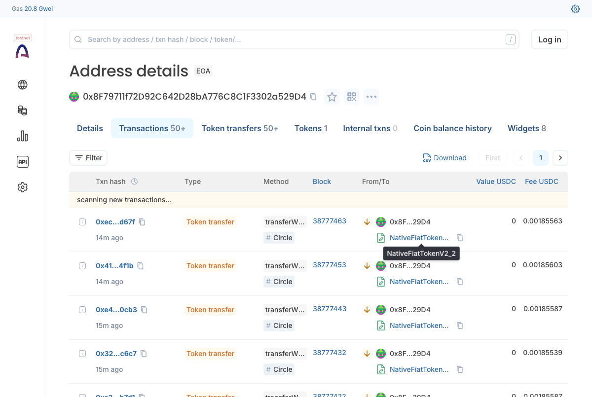
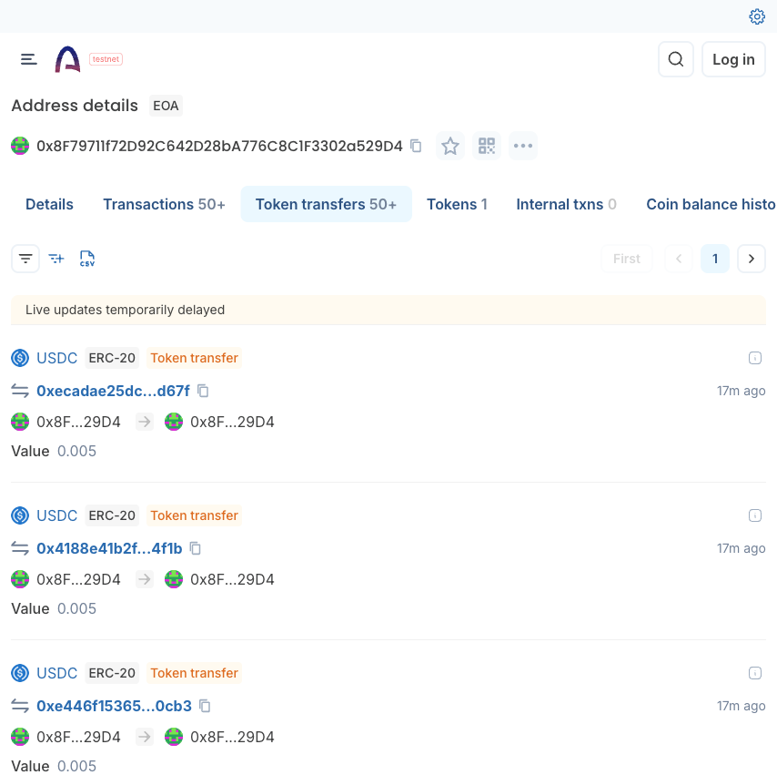
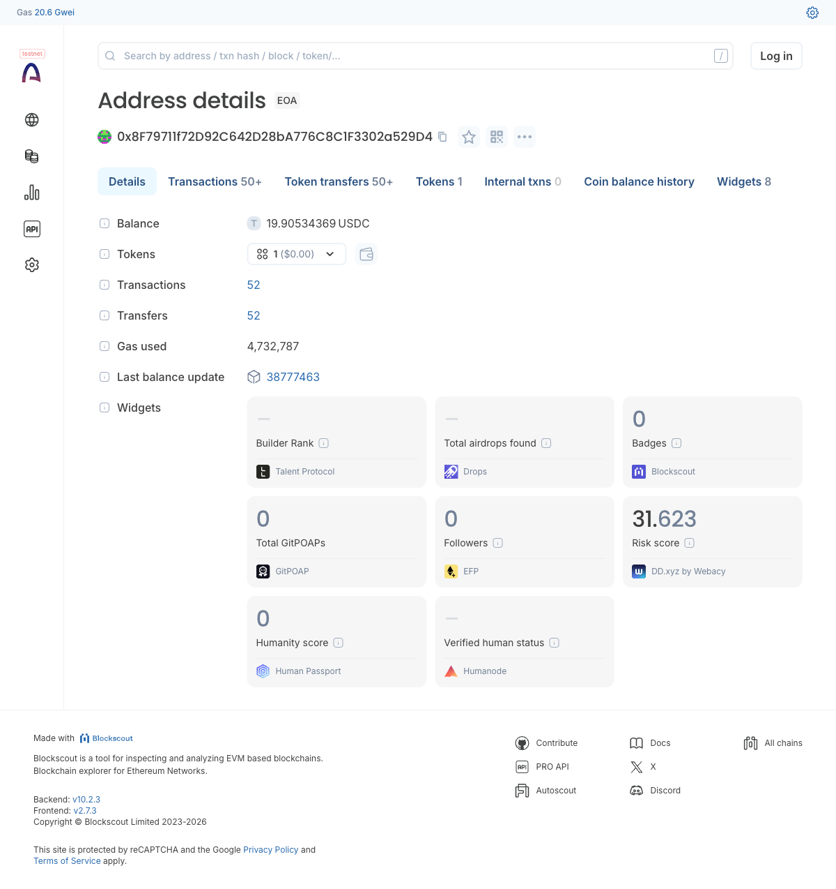

# n8n × x402 Paywall

**One node. Paid workflows. Zero gas.**

Built for *Agentic Economy on Arc* — LabLab × Circle × Arc, April 2026

Team: Nikolay Micheev + Vadim Buss

---

## The Problem

Legacy rails can't price a single API call.

- **Stripe** minimum fee: $0.30 per charge
- **n8n** usage: monthly SaaS subscription, no per-call billing
- **Traditional gas**: $0.10–$5.00 destroys any $0.005 transaction

Sub-cent commerce is **economically impossible** on today's rails.

---

## The Insight

> x402 (HTTP 402) + USDC on Arc = sub-cent, sub-second, **zero gas** for the creator.

Arc settles USDC at near-zero cost. x402 makes it a header exchange. No accounts, no keys on the server, no chargebacks.

**A workflow can charge $0.005 per call and keep 100%.**

---

## What We Built

**`n8n-nodes-x402-paywall`** — one community node, published to the n8n community catalog.

- **MIT license**, originality verified
- **Paywall Trigger** — drop it at the start of any workflow
- Returns `402 Payment Required`, verifies signature, triggers downstream
- Self-hosted x402 facilitator included (Circle-ready)

---

## How It Works

```
Client ──▶ POST /paywall ──▶ 402 { accepts: [Arc USDC, $0.005] }
Client ──▶ sign EIP-3009 authorization (USDC transferWithAuthorization)
Client ──▶ POST /paywall  +  X-PAYMENT header
Server ──▶ facilitator.verify() ──▶ facilitator.settle() ──▶ Arc txHash
Server ──▶ triggers n8n workflow ──▶ 200 OK  + X-PAYMENT-RESPONSE
```

One HTTP round-trip. One on-chain settlement. One workflow execution.

---

## Live in Action

 

**Left:** 50+ `transferWithAuthorization` calls on Arc, method `Circle`, contract `NativeFiatTokenV2_2`.
**Right:** Every USDC transfer at exactly `0.005` — our configured price.

---

## 50 Real Transactions on Arc



- **50 of 50** settled — `assets/burst-50-evidence.json`
- **Avg end-to-end 4750 ms** (probe + EIP-3009 sign + /verify + /settle + Arc confirmation)
- **Gas paid by the merchant: $0.00** — facilitator absorbs it
- Every tx resolvable at `testnet.arcscan.app/tx/<hash>` (see `assets/arc-explorer-links.md`)

---

## Margin Story

| Rail         | Fixed fee  | Feasible @ $0.005? |
|--------------|------------|---------------------|
| Stripe       | $0.30 min  | No (60× price)      |
| ACH          | $0.20      | No (40× price)      |
| Wire         | $25.00     | Absurd              |
| **x402 + Arc** | **$0.00 gas** | **Yes — 100% margin** |

---

## Real Use Cases

- **Telegram bots** — pay $0.002 per LLM reply
- **LLM APIs** — metered per-token gateways, no subscription
- **A2A commerce** — agents paying agents for data, code, inference
- **Paid scrapers, signals, embeddings** — any n8n workflow becomes a priced endpoint

---

## 2-Agent Autonomous Loop

**Buyer workflow** (our burst script, x402 payer client)
⇅
**Seller workflow** (our Paywall Trigger node, on the same n8n VPS)

**No human in the loop.** 50 autonomous settlements. Agent-A signs, Agent-B verifies, Arc settles. Loop repeats.

---

## Circle Stack Used

- **Arc Testnet** — sub-second USDC settlement
- **USDC** — EIP-3009 `transferWithAuthorization`
- **x402 protocol** — HTTP 402 payment handshake
- **Self-hosted facilitator** — drop-in Circle replacement for testnet

Track: **Best Autonomous Commerce Application**

---

# Thanks

**GitHub**: github.com/buss2020/n8n-nodes-x402-paywall
**Live**: https://n8n.xorek.cloud (Paywall Trigger demo)
**Install**: `npm i n8n-nodes-x402-paywall`
**License**: MIT

**Team**: Nikolay Micheev · Vadim Buss
